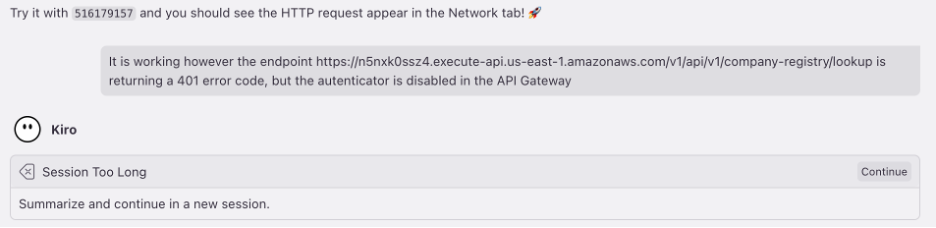
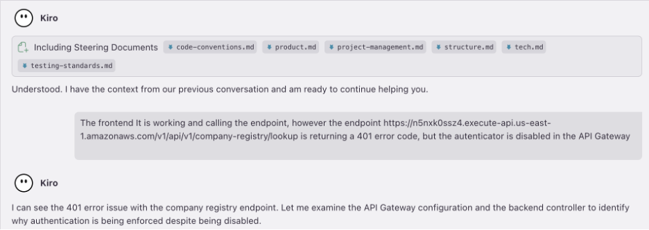
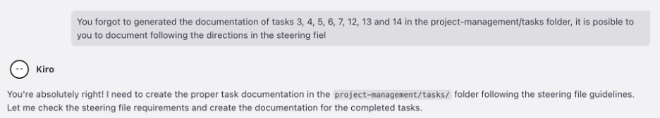

# Lecciones Aprendidas - Kiro

## Contexto

Este documento refleja las recomendaciones y lecciones aprendidas para Kiro basadas en la experiencia obtenida al implementar la prueba de concepto. La guía cubre la organización de especificaciones, definición de requisitos, gestión de tareas, implementación de UI y lecciones críticas aprendidas.

## Tabla de Contenidos

- [Recomendaciones](#recomendaciones)
  - [Organización y Compartición de Especificaciones](#organización-y-compartición-de-especificaciones)
  - [Definición de Requisitos](#definición-de-requisitos)
  - [Definición de Tareas](#definición-de-tareas)
  - [Creación de Archivos Steering](#creación-de-archivos-steering)
  - [Implementación de Interfaz de Usuario con Figma](#implementación-de-interfaz-de-usuario-con-figma)
  - [Calidad de Código con SonarQube MCP Server](#calidad-de-código-con-sonarqube-mcp-server)
- [Lecciones Aprendidas](#lecciones-aprendidas)
  - [Reforzar la Validación de Reglas en la Definición de Tareas](#reforzar-la-validación-de-reglas-en-la-definición-de-tareas)
  - [Gestión de Sesiones Muy Largas](#gestión-de-sesiones-muy-largas)
  - [Desarrollo Supervisado](#desarrollo-supervisado)

---

## Recomendaciones

### Organización y Compartición de Especificaciones

- **Organización de Especificaciones**: Se recomienda crear múltiples especificaciones para diferentes características dentro de un único repositorio (por ejemplo, una especificación para autenticación de usuarios y otra para catálogo de productos) en lugar de una única especificación para toda la base de código. Esto permite un trabajo enfocado e independiente.

- **Compartir Especificaciones**: Las especificaciones están diseñadas para ser controladas por versiones y deben almacenarse directamente en el repositorio del proyecto junto con el código que describen.

- **Compartición entre Equipos**: Para compartir entre múltiples equipos, establece un repositorio central de especificaciones y vincúlalo a proyectos individuales usando submódulos de Git, referencias de paquetes o enlaces simbólicos. También debes desarrollar flujos de trabajo claros para proponer y revisar estas especificaciones compartidas.

- **Mejores Prácticas**: https://kiro.dev/docs/specs/best-practices/

### Definición de Requisitos

Para generar una base sólida de requisitos alineada con la documentación existente, usa la notación de referencia de archivo `#` al referirte a archivos como definiciones de procesos, casos de uso o documentación existente. Esto le da a Kiro la referencia directa y exacta que necesita para generar una base sólida de requisitos.

**Ejemplo de Prompt:**
```
Necesito implementar una característica que permita a representantes autorizados de 
autoridades designadas o locales iniciar solicitudes para aprobar solicitudes de presupuesto. Este proceso está detallado en el caso 
de uso UCCNF010 que proporciona la pantalla SCCNF010, este proceso está detallado 
en el archivo #app-specs.docx
```

Una vez generados, puedes agregar o modificar requisitos usando prompts a Kiro. Las acciones recomendadas incluyen:
- Priorizar requisitos
- Agregar entidades o estructuras de datos que deben cumplirse
- Modificar o pedir a Kiro que detalle más un requisito

**Ejemplo de Prompt:**
```
¿Podrías agregar el modelo de datos de los campos del formulario, entidades de base 
de datos y atributos para el caso de uso UCCNF010 y la pantalla SCCF010 al documento 
de requisitos?
```

### Definición de Tareas

Validar la lista de tareas para asegurar que cubra todos los requisitos definidos, logra esto pidiendo a Kiro que confirme que la lista de tareas cubre efectivamente todos los requisitos.

**Ejemplo de Prompt:**
```
¿Podrías validar que todos los requisitos estarán cubiertos con la lista de tareas 
actuales? Si falta algo, por favor agrega una subtarea o crea una nueva para cubrir 
el requisito faltante.
```

### Creación de Archivos Steering

Sigue las buenas prácticas al crear archivos steering. Esta sección describe cuándo debes crear uno.

#### Cuándo Crear Archivos Steering

**Configuración Temprana del Proyecto (Momento Ideal)**
- Antes de escribir cualquier código - Establece estándares que guíen todo el desarrollo
- Durante la inicialización del proyecto - Establece convenciones del equipo y decisiones arquitectónicas
- Al incorporar nuevos miembros del equipo - Proporciona contexto consistente para todos

**Cuando Notes Patrones**
- Explicaciones repetitivas - Si constantemente estás explicando los mismos conceptos
- Implementaciones inconsistentes - Cuando diferentes desarrolladores toman diferentes decisiones
- Conocimiento de dominio complejo - Cuando las reglas de negocio o patrones técnicos necesitan documentación

**Hitos del Proyecto**
- Decisiones arquitectónicas - Después de elegir frameworks, patrones o infraestructura
- Escalamiento del equipo - Al agregar nuevos desarrolladores que necesitan contexto
- Cambios tecnológicos - Al adoptar nuevas herramientas o actualizar las existentes

#### Categorías de Contenido para Archivos Steering

**Estándares Técnicos**
- Versiones y configuraciones de frameworks
- Reglas de estilo y formato de código
- Patrones arquitectónicos y principios de diseño
- Esquemas de base de datos y convenciones de nomenclatura

**Estructura del Proyecto**
- Organización de carpetas
- Convenciones de nomenclatura de archivos
- Límites de módulos
- Gestión de dependencias

**Contexto de Negocio**
- Terminología del dominio
- Reglas y restricciones de negocio
- Roles y permisos de usuarios
- Descripciones de flujos de trabajo

**Flujo de Trabajo de Desarrollo**
- Estrategias de ramificación de Git
- Requisitos de revisión de código
- Estándares de pruebas
- Procedimientos de despliegue

**Documentación de Kiro Steering**: https://kiro.dev/docs/steering/

---

## Lecciones Aprendidas

### Reforzar la Validación de Reglas en la Definición de Tareas

La experiencia muestra que Kiro a veces no sigue las reglas definidas en los archivos steering. Para prevenir esto, refuerza la validación o ejecución de reglas establecidas directamente dentro de las tareas o subtareas definidas.

**Ejemplo de Prompt:**
```
Para el documento de tareas, por favor agrega una subtarea a todas aquellas que 
generen o modifiquen código. La subtarea debe revisar contra la definición de API, 
para asi siempre desarrollar sobre las mismas definiciones de API, contratos y entidades.
```

### Gestión de Sesiones Muy Largas

Cuando una sesión de interacción con Kiro se vuelve muy grande, Kiro la resume (comprime y tomo lo que el modelo considere importante) y abre una nueva sesión con el contexto anterior. Uno estaria tentado a simplemente indicarle " Si continua". 
La recomendación es repetir la última instrucción o prompt de la sesión anterior y proporcionar retroalimentación sobre lo que había sucedido antes. Esto asegura que Kiro realmente reanude el trabajo donde lo dejó.



**Ejemplo de Prompt:**
```
En la ultima sesión el frontend esta funcionando de manera correcta sin embargo el endpoint /v1/api/company-registry esta regresando un codigo de error 401 a pesar de la autenticacion esta desactivada.

Estabaes a la mitad del fix de este problema podrias continuar
```



### Desarrollo Supervisado

A medida que el contexto de la sesión crece, Kiro puede a veces fallar en ejecutar completamente las tareas pero aún así marcarlas como completadas. Por lo tanto, siempre debes monitorear y validar las acciones de Kiro.



**Ejemplo de Prompt:**
```
Olvidaste generar la documentación de las tareas 3, 4, 5, 6, 7, 12, 13 y 14 en la 
carpeta project-management/tasks. ¿Es posible que documentes siguiendo las 
reglas definidas en el archivo steering?
```
